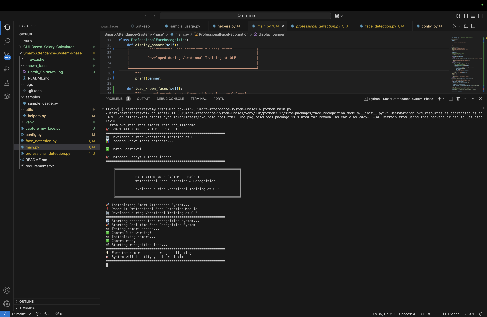
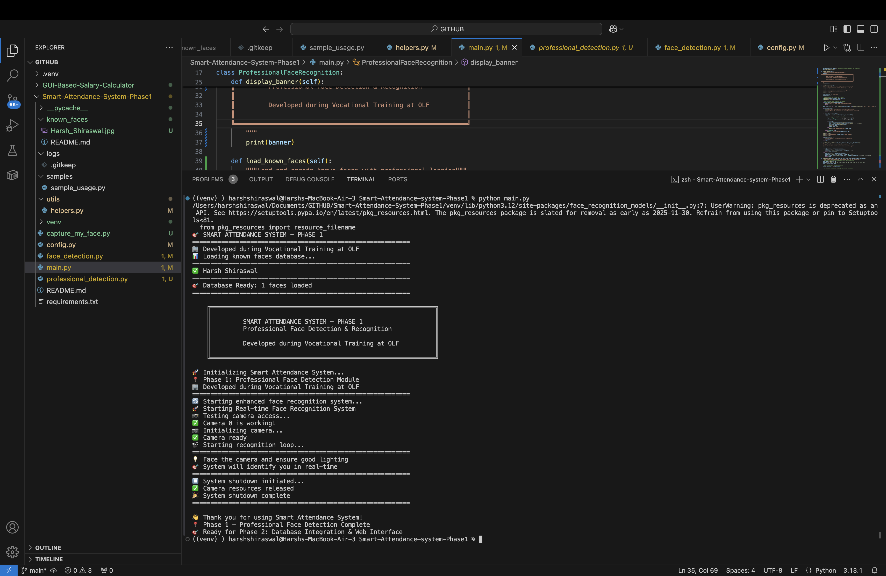

# 📸 Demonstration Gallery - Smart Attendance System

## System Workflow

### 1. System Initialization

*System loads face database, initializes camera, and prepares for recognition*

### 2. Real-time Recognition  

*Live face recognition with confidence scoring and professional UI overlay*

### 3. System Shutdown

*Graceful shutdown with proper resource cleanup and session summary*

## 🎯 Key Features Demonstrated

- **Real-time Face Detection**: Instant face detection from camera feed
- **High Accuracy Recognition**: Confidence-based matching (85%+ threshold)
- **Professional UI**: Clean interface with system status and FPS counter
- **Stable Performance**: Smooth face tracking without flickering
- **Multi-face Support**: Simultaneous recognition of multiple persons
- **Camera Compatibility**: Works with both built-in and external webcams

## 📋 Technical Details

- **Framework**: Python, OpenCV, face_recognition
- **Processing**: Real-time at 30 FPS
- **Confidence Scoring**: Standard face recognition confidence formula
- **UI**: Professional overlay with corner-marked bounding boxes
- **Platform**: Cross-platform (macOS, Windows, Linux)

---

*Smart Attendance System - Phase 1*  
*Developed during Vocational Training at OLF*  
*Face Detection and Recognition Module*
